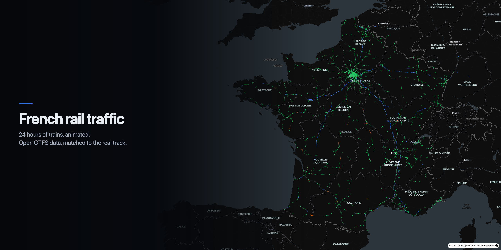

<a href="https://www.linkedin.com/in/jeremy-magrin/">
  
</a>

[](README.md)
[](README.fr.md)

# French rail traffic — animated over 24 hours

[](LICENSE)
[](#licence)
[](https://github.com/magrinj/france-rail-traffic/actions/workflows/carte-quotidienne.yml)


An animated web map of French train services, from 00:00 to 24:00. Every train is a moving
point that follows the **actual track geometry** (map-matched against OpenStreetMap),
trailing a tail whose length is expressed in units of *time* — so a high-speed train
mechanically leaves a longer trail than a regional one, with no speed calculation anywhere.

The pipeline starts from the open GTFS timetables of SNCF Voyageurs and Transilien, matches
them to the OpenStreetMap rail network, and publishes seven browsable days. No API key is
required at any step.

## Result

Figures for **Wednesday 26 August 2026**, the day used for illustration. The pipeline is
replayed nightly, so published values change from one day to the next: a Sunday carries
roughly a third fewer runs than a weekday.

| | |
|---|---|
| Train runs | **13,602** |
| Simultaneous peak | **1,481 trains at 18:10** |
| Overnight trough | **16 trains at 02:26** |
| Map-matching rate | **100 %** — zero straight-line fallbacks |
| Median stop ↔ trace offset | **23.2 m** (p90 81.1 m · p99 104.3 m · max 385.8 m) |
| Data served to the browser | **27.9 MB** binary, 2,318,435 vertices |
| Measured performance | **over 110 fps** at peak (Chrome, Apple Silicon, 120 Hz display) |

| Category | Trains | Share | Brands |
|---|---:|---:|---|
| 🔵 High speed | 642 | 4.7 % | TGV INOUI 503, OUIGO 74, Lyria 33, ICE 26, Paris–Brussels 6 |
| 🟠 Long distance | 79 | 0.6 % | Intercités |
| 🟡 Night | 32 | 0.2 % | Intercités de Nuit |
| 🟢 Regional | 12,849 | 94.5 % | TER 8,066, RER A–E, Transilien H/J/K/L/N/P/R/U/V, tram-train 217 |

Simultaneous trains, hourly average:

```
00h    60  █          08h  1262  █████████████████████    16h   993  █████████████████
01h    26  ▏          09h   925  ███████████████          17h  1351  ███████████████████████
02h    18  ▏          10h   742  ████████████             18h  1440  ████████████████████████
03h    18  ▏          11h   756  █████████████            19h  1296  ██████████████████████
04h    36  █          12h   837  ██████████████           20h   938  ████████████████
05h   292  █████      13h   874  ███████████████          21h   598  ██████████
06h   964  ████████   14h   765  █████████████            22h   320  █████
07h  1367  ████████   15h   754  █████████████            23h   122  ██
```

## Interface

Controls sit along the edges; the map owns the centre.

| Position | Contents |
|---|---|
| Top left | **France / Corsica** selector, **Trains** and **Network** switches |
| Top right | clock, date, train count, seven-day strip, **Today's figures**, **About** |
| Bottom left | the four categories, clickable as filters, plus two odometers |
| Bottom centre | the activity curve, which doubles as the scrubber |

Clicking a category hides it; clicking the last remaining active one restores them all. The
*Trains* and *Network* switches are independent: hiding the trains leaves the network alone.
The curve can be clicked and dragged directly, five buttons set the speed, and the space bar
pauses. On reaching midnight, playback moves to the next day in the collection.

## Window of days

The site publishes **seven days** and lets the visitor pick the date, through the pills in
the header or the left and right arrow keys. The window straddles the current day: three
days back, today, three days ahead.

```bash
python scripts/build_window.py                     # the default window
python scripts/build_window.py --back 3 --forward 3
python scripts/build_window.py --today 20260901    # force the reference day
```

Each day is computed independently — merge, map-matching, precompute, then the ten checks —
and written to `dist/data/<YYYYMMDD>/`. `dist/data/days.json` lists what is available and
names the default date.

**Nothing is carried over between runs.** All seven days are fully recomputed every night,
which costs about six minutes and removes any possibility of a cache drifting silently.
**A failing day does not take the others down**: it is set aside, the remaining six are
published, and the workflow exits with an error to flag it.

Two limits follow from the feed being **forward-looking**: no date earlier than its
publication can be reconstructed, and the requested window is automatically trimmed to the
actual coverage read from `feed_info.txt`. The national feed covers roughly 150 days ahead.

## The Corsican network, as a separate collection

Chemins de fer de Corse is not part of the SNCF feed. It publishes its own GTFS on
data.gouv.fr, and that feed **already contains its `shapes.txt`**: no map-matching needed.
The median offset between a station and its trace is **0.9 m** there, against 23 m for the
reconstructed traces — these are the operator's own geometries.

> **The dates are not recent, and cannot be.** This feed's calendar only covers **the week
> of 3–9 March 2026**, and the file has not been refreshed since. The Corsica collection
> therefore shows that week, as-is. This is not an update lag: it is everything the
> source contains.

That is why Corsica is a **separate collection** rather than a layer of the France map.
Overlaying a week from March onto the rolling SNCF window would suggest the two describe
the same day. Switching collection reloads the matching week, reframes the map on the
island, and states why the dates differ. The two networks are never mixed, and no data is
ever replayed on a date that is not its own.

```bash
python scripts/build_window.py --corse     # the 7 Corsican days
python scripts/build_window.py             # the SNCF window, without overwriting Corsica
```

Days range from **55 runs on Sunday to 102 on Wednesday**, over 6 lines and 267 stops.
**Three checks are declared out of scope** rather than failed: the Paris–Marseille
high-speed line, Paris-region density, and conformance to the national rail network — of
which CFC is not part. The per-department service analysis is likewise skipped: it covers
mainland France and would be meaningless on a single island.

## Network layer and service statistics

**The network layer** colours each station-to-station segment by its daily traffic, in five
classes — 1–5, 6–20, 21–60, 61–150 and 151+ runs. The purple-magenta range is used by none
of the four train categories, so a busy segment cannot be mistaken for a train.

**Service statistics are recomputed for every day**: the number of trains per department
varies sharply between a Tuesday and a Sunday, and the share of runs touching the Paris
region moves from 43.7 % on a Monday to 56.4 % on a Sunday. Sources are the 34,957 communes
from `geo.api.gouv.fr` with their population, plus the outlines of the 96 departments. All
distances are **as the crow flies** — computing a road isochrone would require a routing
engine, so thresholds are stated in kilometres, never in minutes.

## Replaying the pipeline

```bash
TARGET_DATE=20260826 ./scripts/run_all.sh   # one day, from scratch (~25 min, ~25 GB)
python scripts/build_window.py              # the seven days (~6 min once primed)
./scripts/serve.sh                          # then http://localhost:8777/
```

Switching to another day once the sources are in place takes only **50 seconds**: neither
the GTFS feeds nor the filtered rail network are downloaded again. The target date is set
through `TARGET_DATE` (`YYYYMMDD`); without it, the pipeline uses today.

Step by step:

```bash
.venv/bin/python scripts/gtfs_inspect.py     # 1. inspection report on both feeds
.venv/bin/python scripts/merge_gtfs.py       # 2. merge + filter to the target date
bash scripts/run_pfaedle.sh                  # 3. OSM filtering + map-matching (slow)
.venv/bin/python scripts/precompute.py       # 4. trajectories -> binary
.venv/bin/python scripts/verify.py           # 5. quality checks (exits 1 on failure)
.venv/bin/python scripts/export_segments.py  # 6. station-to-station dataset + network layer
.venv/bin/python scripts/analyse_desserte.py # 7. service statistics for the day
```

Requirements: `python3.11`, `uv`, `cmake`, `g++`, `curl`, `unzip`. pfaedle is compiled
natively from source (~2 min); the `ghcr.io/ad-freiburg/pfaedle` Docker image is a fallback,
but it is amd64 and runs under emulation on Apple Silicon.

The site is rebuilt and published nightly by
[`.github/workflows/carte-quotidienne.yml`](.github/workflows/carte-quotidienne.yml).

## Architecture

```
data/raw/                    downloaded sources (GTFS ×2, France PBF 4.8 GB)
data/processed/
  merged/                    merged GTFS feed, filtered to the date, rail only
  france-rail.osm.pbf        rail network extracted from the France PBF (4.8 GB -> 14 MB)
  gtfs-shaped/               pfaedle output, with shapes.txt
  web/<category>/*.bin       binary trajectories for the current day
  web/meta.json              hourly slice index + activity curve
  trip_meta.csv              commercial category and time offset per trip
dist/data/<YYYYMMDD>/        one published day
dist/data/days.json          available days, collections and default date
scripts/                     the pipeline
web/index.html               the source page (MapLibre GL JS + deck.gl, no token)
dist/                        the assembled site, served and published (not in the repo)
```

Binary format, per category — consumed as-is by `TripsLayer`:

| File | Type | Contents |
|---|---|---|
| `pos.bin` | `Float32` | interleaved `lon, lat` |
| `time.bin` | `Float32` | seconds since midnight |
| `idx.bin` | `Uint32` | `startIndices`, counted in vertices |

## Three decisions that shape the result

**Extended `route_type`s do not exist in these feeds.** Classifying trains by codes
101/102/105/106 was not possible: the SNCF feed only uses the base codes, `2` (rail), `0`
(tram-train) and `3` (coach). Classification therefore relies on the **commercial brand
encoded in the `stop_id`** (`StopPoint:OCETGV INOUI-87686006`), present and unique for
100 % of trips — far more reliable than a heuristic on train numbers.

**The previous day's trains are loaded.** A run departing at 21:00 on 25 August and arriving
at 09:00 on the 26th is described in GTFS as a trip on the 25th with times past `24:00:00`.
Without it, the map would be empty from 00:00 to 05:00 and half the night trains would be
missing. The pipeline therefore loads day D **and** D−1, keeps from D−1 only the runs that
spill past midnight, and shifts them by −86,400 s.

**Hourly slicing to hold 60 fps.** deck.gl processes *every* vertex of a `TripsLayer` on
every frame, including those outside the trail window: drawing all 2.3 M vertices at once
caps at 16 fps, identical at 03:00 (18 trains) and at 18:00 (1,400 trains) — the cost is
purely geometric. Each trajectory is therefore cut into one-hour slices, with 600 s of
overlap so the trail stays continuous across an hour boundary. Result: 60 fps, for +16 %
data volume.

## Automated checks

`scripts/verify.py` exits with code 1 if any of these ten checks fails. They are replayed
for **every day** in the window, and a day that fails is not published: this is the
deployment gate, not an advisory report.

| Check | What it catches |
|---|---|
| No jump > 5 km between two 30 s samples | a teleporting trace, a corrupted trajectory |
| Paris → Marseille TGV on the high-speed line, 4 waypoints | a match that took the classic line |
| That TGV does not cut across the Massif Central | a silent straight-line fallback |
| Stationary during station stops | a train sliding instead of standing |
| Pronounced overnight trough | a badly filtered calendar |
| Traffic peaks by day, not by night | an inverted or broken activity curve |
| Paris-region density | a failed Transilien merge |
| Map-matching rate ≥ 85 % | an incomplete OSM extraction |
| Median stop ↔ trace offset < 100 m | stops misplaced along their trace |
| **Conformance to the SNCF Réseau reference** | **a trace that does not follow a real track** |

The last one is the most useful, because it calls on an **independent source** that plays no
part in the construction: SNCF Réseau's
[national rail line geometry file](https://data.sncf.com/explore/dataset/formes-des-lignes-du-rfn/).
Result on the reference day: **median offset 7.5 m**, 98.1 % of points within 25 m. The
check excludes Île-de-France, because the central sections of the RER lines belong to RATP
and do not appear in the national rail network: comparing traces there would measure a hole
in the reference, not a matching error. Nor does it fail if data.sncf.com is
unavailable — a check that breaks the build when a third-party source coughs would be worse
than no check at all.

## Pre-publication audit

Run before opening the repository, and repeated after each batch of changes.

| Item | State |
|---|---|
| Secrets, tokens, keys | none |
| Absolute paths, identity | none |
| CDN resources | 3, all with an `integrity` hash |
| pfaedle image | pinned by digest |
| Python dependencies | versions pinned |
| HTML interpolation of third-party data | escaped |
| Third-party archives | zip-slip guard before extraction |
| Console errors after a full cycle | none |
| Versioned files | 20, 173 KB of git objects |

## Sources

| Source | Contents | Licence |
|---|---|---|
| [GTFS SNCF Voyageurs](https://eu.ftp.opendatasoft.com/sncf/plandata/Export_OpenData_SNCF_GTFS_NewTripId.zip) | TGV, Intercités, TER — forward-looking feed ~150 days | ODbL |
| [GTFS Transilien](https://eu.ftp.opendatasoft.com/sncf/gtfs/transilien-gtfs.zip) | RER A–E, Transilien H/J/K/L/N/P/R/U/V, TER Île-de-France | ODbL |
| [GTFS Chemins de fer de Corse](https://www.data.gouv.fr/datasets/gtfs-transport-horaires-chemins-de-fer-corse-1/) | Corsican network, week of 3–9 March 2026 | ODbL |
| [OpenStreetMap / Geofabrik](https://download.geofabrik.de/europe/france-latest.osm.pbf) | rail network geometry (md5 checksum verified) | ODbL |
| [SNCF Réseau — national rail line geometry](https://data.sncf.com/explore/dataset/formes-des-lignes-du-rfn/) | verification reference only | ODbL |
| [pfaedle](https://github.com/ad-freiburg/pfaedle) | GTFS ↔ OSM map-matching | GPL-3.0 |
| [Carto dark matter](https://basemaps.cartocdn.com/gl/dark-matter-gl-style/style.json) | basemap | — |

## Licence

Two distinct regimes, not to be confused:

- **The code** in this repository is under the [MIT licence](LICENSE): free to reuse,
  modify and host, including commercially.
- **The data produced** — trajectories and station-to-station segments — is under **ODbL**,
  by inheritance: it derives from the SNCF GTFS feeds and from OpenStreetMap, both ODbL with
  share-alike. Any reuse must keep that licence and credit
  "SNCF Voyageurs and the OpenStreetMap contributors".

`pfaedle` is GPL-3.0, but it is invoked as an executable in a subprocess: it is not linked
into this repository's code and therefore does not constrain its licence.

## Known limitations

- **Scheduled timetables, not real time.** The feed describes the planned service: no
  delays, no cancellations, no extra trains. A forward-looking feed may also differ from what
  actually ran that day.
- **No freight.** These feeds only cover passenger services. Freight accounts for a
  significant share of real traffic, entirely absent from this map.
- **Non-SNCF operators absent or partial.** Eurostar and Thalys are not published as such;
  only 6 Paris–Brussels runs appear, under the generic "Train" brand. Trenitalia France,
  Renfe and the new entrants do not appear in the feed. RER A and B, on the other hand, are
  covered in full, including the RATP-operated sections.
- **1,631 TER coaches and 323 replacement buses are excluded**: these are road services, not
  trains. 219 runs duplicated across the two feeds were deduplicated on
  (train number, departure time).
- **Constant speed between stops.** Interpolation is linear in distance: no acceleration, no
  braking, no slowing through curves. Position is exact at stops, approximate between them.
- **Tram-trains are treated as rail.** The 217 tram-train runs (Mulhouse,
  Nantes–Châteaubriant, Sarreguemines) are forced to `route_type=2` for map-matching; their
  street-running sections may be approximate.
- **The largest stop ↔ trace offset, 385.8 m, is at Basel Saint-Jean** — a Swiss station on
  the edge of the French OSM extract. One trip was discarded, for want of two usable points.
- **The reference day is a Wednesday in August**, outside term time: TER and Transilien
  traffic is appreciably lighter than on a Wednesday in October.

## Map-matching figures

pfaedle processed all 13,604 trips in 10 s on a graph of 114,852 nodes and 275,996 edges,
peak memory 888.91 MB, producing 3,879 distinct traces — trips sharing the same stop
sequence share their trace. Pre-filtering the France PBF brings 4.8 GB down to 14 MB, which
is what makes this step possible in a few dozen seconds.

## Support

If you find this project useful, consider supporting its development:

<a href="https://buymeacoffee.com/magrinj" target="_blank">
  
</a>

---

<p align="center">
  Vibe-coded with ♥ by <a href="https://www.linkedin.com/in/jeremy-magrin/">Jérémy Magrin</a>
</p>

<p align="center">
  If you find this useful, please star it ⭐ — it helps a lot!
</p>
